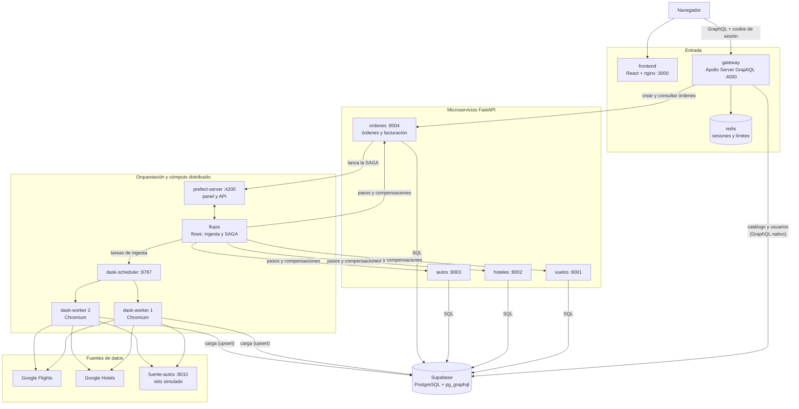
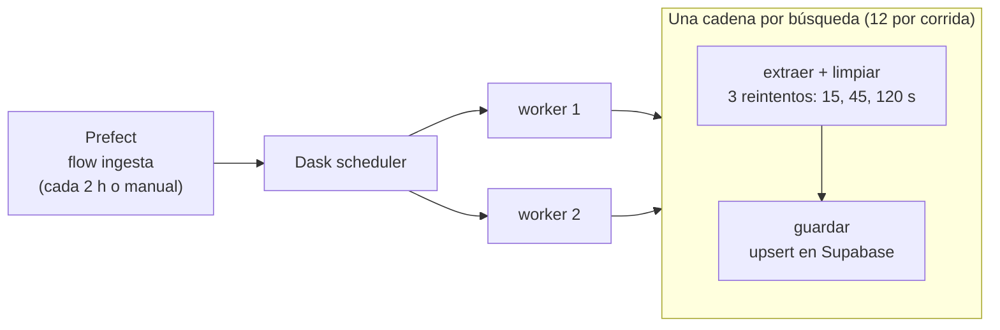
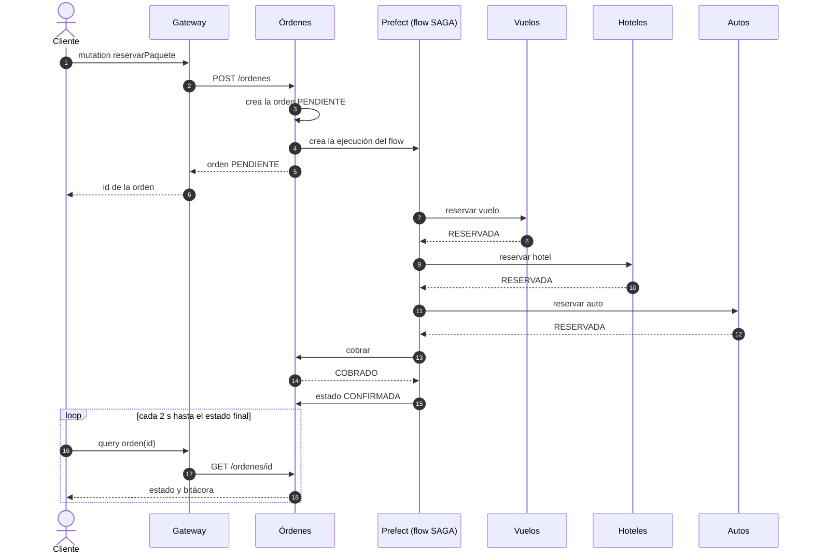
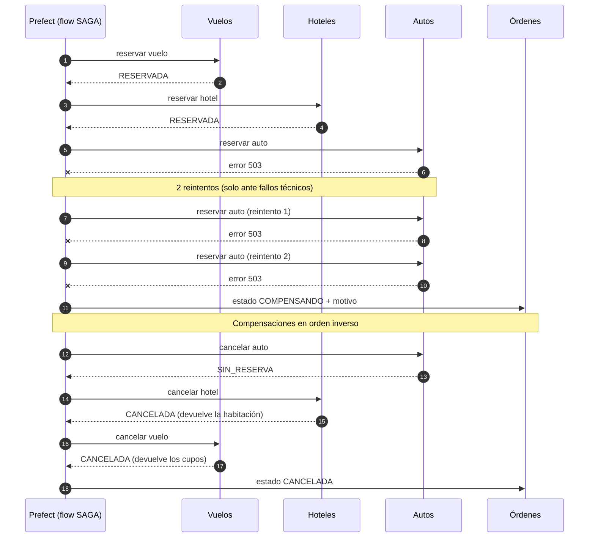

# Documento técnico de arquitectura — WanderSync Travel Solutions

**Asignatura:** Patrones Arquitectónicos Avanzados · **Evaluación:** Parcial práctico del segundo corte
**Autor:** Santiago Rodríguez · **Repositorio:** https://github.com/Santiago1301/SistemaReservas

## 1. Resumen

WanderSync vende paquetes turísticos que combinan vuelo, hotel y auto. El rediseño resuelve los dos
problemas que describe el enunciado:

- **Reservas huérfanas.** Una reserva de paquete es una transacción distribuida entre cuatro servicios.
  Se gestiona con el patrón SAGA orquestado: si un paso falla, los pasos ya hechos se revierten solos.
- **Cuellos de botella en la sincronización de tarifas.** La captura de datos corre fuera de los servicios
  de la aplicación, en un clúster de Dask orquestado por Prefect.

| Tecnología obligatoria | Uso en la solución |
|---|---|
| Docker Compose | 13 contenedores; todo el sistema levanta con `docker compose up` |
| GraphQL | Gateway con Apollo Server, y GraphQL nativo de la base (`pg_graphql` de Supabase) |
| Patrón SAGA | Orquestación en un flow de Prefect con compensaciones automáticas |
| Dask | Scheduler y 2 workers que paralelizan scraping, limpieza y carga |
| Prefect | Flows de ingesta y de SAGA, reintentos y panel de monitoreo |

## 2. Arquitectura

### 2.1 Contenedores

| Contenedor | Tecnología | Responsabilidad | Puerto |
|---|---|---|---|
| `frontend` | React, Vite, nginx | Interfaz web | 3000 |
| `gateway` | Node, Apollo Server | Única entrada del frontend; sesiones, límites y composición | 4000 |
| `redis` | Redis 7 | Sesiones y contadores de límite | interno |
| `vuelos` | FastAPI | Reserva y cancelación de cupos | 8001 |
| `hoteles` | FastAPI | Reserva y cancelación de habitaciones | 8002 |
| `autos` | FastAPI | Reserva y cancelación de vehículos | 8003 |
| `ordenes` | FastAPI | Órdenes, cobro, reembolso y bitácora de la SAGA | 8004 |
| `prefect-server` | Prefect 3 | API y panel de orquestación | 4200 |
| `flujos` | Prefect 3 | Registra y ejecuta los flows de ingesta y SAGA | — |
| `dask-scheduler` | Dask | Reparte tareas entre los workers; panel | 8787 |
| `dask-worker` ×2 | Dask, Playwright | Ejecutan scraping, limpieza y carga | — |
| `fuente-autos` | FastAPI | Sitio simulado de alquiler de autos | 8010 |

La base de datos es Supabase en la nube. Cada contenedor recibe solo las variables que necesita:
los microservicios y los workers reciben la cadena de conexión; el gateway, la clave de la API; ninguno recibe el `.env` completo.

### 2.2 Propiedad de los datos

Cada microservicio es dueño de sus tablas y es el único que escribe en ellas.

| Dueño | Tablas |
|---|---|
| Ingesta (workers de Dask) | `vuelos`, `hoteles`, `autos` (datos de catálogo) |
| Servicio de vuelos | `reservas_vuelo`, y el inventario de `vuelos` |
| Servicio de hoteles | `reservas_hotel`, y el inventario de `hoteles` |
| Servicio de autos | `reservas_auto`, y el inventario de `autos` |
| Servicio de órdenes | `ordenes`, `pagos`, `saga_pasos` |
| Gateway | `usuarios` |

Solo hay llaves foráneas entre tablas del mismo servicio. Entre servicios se guarda el identificador
sin restricción (por ejemplo `orden_id` en `reservas_vuelo`). Es deliberado: si la base de datos garantizara la
consistencia entre servicios, la SAGA no tendría razón de ser.

## 3. Ingesta distribuida (Dask + Prefect)

- **Cobertura por corrida:** vuelos desde Bogotá a Cartagena, Medellín, Cali y Santa Marta; hoteles y autos en esos
  cuatro destinos. Son 12 cadenas y 24 tareas.
- **Paralelismo:** `submit()` entrega cada tarea a Dask y devuelve de inmediato. Pasar el resultado pendiente de
  "extraer" a "guardar" encadena las dos tareas sin bloquear el flow.
- **Reintentos:** 3 por tarea, con esperas crecientes y variación aleatoria, para que un límite temporal de la fuente
  tenga tiempo de levantarse.
- **Resiliencia:** una cadena que agota sus reintentos no detiene a las demás. El flow termina en rojo para que el
  fallo sea visible, y el catálogo conserva los últimos datos buenos (cada registro lleva `fuente` y `extraido_en`).
- **Carga idempotente:** cada tabla tiene una clave única de negocio. La carga inserta o actualiza, nunca duplica,
  y no toca el inventario.

### 3.1 Fuentes de datos

El enunciado permite fuentes reales o simuladas. Se probaron las tres plataformas sugeridas:

| Sitio | Resultado con un navegador automatizado | Evidencia |
|---|---|---|
| Booking.com | Hoteles: descarta la búsqueda. Autos: CAPTCHA. Vuelos: su API responde 403 | `docs/evidencia-scraping/booking_*.png` |
| Kayak | Redirige a la página "¿Qué es un bot?" | `docs/evidencia-scraping/kayak_*.png` |
| Google Flights y Google Hotels | Entregan resultados, también desde un contenedor Linux sin pantalla | `docs/evidencia-scraping/google_*.png` |

No se usaron técnicas para ocultar la automatización ni para resolver CAPTCHAs. La decisión fue:

| Servicio | Fuente | Técnica |
|---|---|---|
| Vuelos | Google Flights (real) | Playwright + Chromium; se interpreta la descripción accesible (`aria-label`) de cada resultado |
| Hoteles | Google Hotels (real) | Igual; las fechas se escriben en el formulario porque el sitio no las acepta por URL |
| Autos | Sitio simulado propio | HTML estático con latencia variable y 30 % de errores 503, para ejercitar los reintentos |

Se interpreta el `aria-label` y no las clases CSS porque Google genera las clases automáticamente y las cambia con frecuencia.

## 4. API Gateway GraphQL

El frontend solo conoce una dirección: `/graphql` en el gateway.

| Operación | Tipo | Descripción |
|---|---|---|
| `destinos` | Consulta | Ciudades con oferta |
| `disponibilidad` | Consulta | Vuelos, hoteles y autos con inventario para un viaje, y el paquete más económico calculado |
| `me`, `orden`, `misOrdenes` | Consulta | Datos del usuario con sesión |
| `registrar`, `iniciarSesion`, `cerrarSesion` | Mutación | Autenticación |
| `reservarPaquete` | Mutación | Crea la orden y dispara la SAGA |

- **Consulta compleja de paquetes.** `disponibilidad` consolida en una petición lo que vive en tres tablas, filtra lo
  que no tiene inventario y calcula el paquete más económico.
- **Sin over-fetching de punta a punta.** El cliente pide solo los campos que muestra, y el gateway traslada esa
  selección a la base: a Supabase solo se le piden las columnas solicitadas.
- **Persistencia con GraphQL nativo.** El gateway no abre conexiones SQL. Lee el catálogo y los usuarios por el
  GraphQL que `pg_graphql` genera a partir de las tablas.
- **Sin el problema N+1.** Al listar órdenes, sus vuelos, hoteles y autos se traen en tres consultas agrupadas con DataLoader.
- **Desacoplamiento.** El gateway no toca las tablas de reservas; para reservar llama al servicio de órdenes.

## 5. Patrón SAGA

Se eligió **orquestación**: un flow de Prefect (`flujos/saga.py`) llama a cada servicio en orden y decide qué
compensar. El enunciado pide que Prefect orqueste la SAGA, y un orquestador central deja toda la transacción
visible en un solo lugar.

| Paso | Acción | Compensación |
|---|---|---|
| 1. Vuelo | `POST vuelos/reservas` | `POST vuelos/reservas/{orden}/cancelar` |
| 2. Hotel | `POST hoteles/reservas` | `POST hoteles/reservas/{orden}/cancelar` |
| 3. Auto | `POST autos/reservas` | `POST autos/reservas/{orden}/cancelar` |
| 4. Pago | `POST ordenes/{orden}/pago` | `POST ordenes/{orden}/pago/reembolsar` |

Estados de la orden: `PENDIENTE` → `CONFIRMADA`, o `PENDIENTE` → `COMPENSANDO` → `CANCELADA`.

### 5.1 Flujo exitoso

### 5.2 Fallo y compensaciones (fallo en la reserva del auto)

### 5.3 Decisiones que garantizan la consistencia

- **Idempotencia.** Cada servicio guarda una reserva por `orden_id`. Repetir una reserva devuelve la misma sin
  descontar otra vez, y repetir una cancelación no devuelve inventario dos veces. Por eso un reintento de Prefect es seguro.
- **Reserva atómica.** La comprobación de inventario y la resta ocurren en una sola sentencia SQL
  (`UPDATE ... WHERE cupos_disponibles >= n`). Dos reservas simultáneas no pueden tomar el mismo cupo.
- **El paso que falla también se compensa.** Un paso puede fallar a medias: el servicio reservó, pero la respuesta
  se perdió. Ese es el origen de las reservas huérfanas. Como cancelar siempre es seguro, el paso fallido entra en
  la lista de compensaciones; si no había nada que cancelar, responde `SIN_RESERVA`.
- **Reintentos solo ante fallos técnicos.** Un error de red o 5xx se reintenta 2 veces. Un error de negocio
  (sin cupos, no existe) pasa directo a compensación, porque reintentar no cambia el resultado.
- **Las compensaciones insisten.** Se reintentan hasta 5 veces. Si aun así fallan, el flow queda en rojo y la orden
  en `COMPENSANDO`, que es la señal de que requiere intervención.
- **Clave de idempotencia de la orden.** Un doble clic envía la misma clave y recibe la orden original.
- **Bitácora.** Cada acción y cada compensación queda en `saga_pasos`; el frontend la muestra como línea de tiempo.

### 5.4 Escenarios verificados

| Escenario | Estado final | Inventario |
|---|---|---|
| Sin fallos | `CONFIRMADA`, pago cobrado | Descontado |
| Fallo técnico en vuelo | `CANCELADA` | Sin cambios |
| Fallo técnico en hotel | `CANCELADA`; compensa hotel y vuelo | Restaurado |
| Fallo técnico en auto | `CANCELADA`; compensa auto, hotel y vuelo | Restaurado |
| Fallo técnico en pago | `CANCELADA`; reembolsa y compensa los tres | Restaurado |
| Auto sin unidades (error de negocio) | `CANCELADA` sin reintentos | Restaurado |
| Doble envío de la misma orden | Devuelve la orden original | Una sola reserva |

Para la demostración, la reserva acepta `simularFalloEn` (VUELO, HOTEL, AUTO o PAGO), que hace fallar ese paso.

## 6. Ciberseguridad por diseño

| Requisito | Implementación | Dónde |
|---|---|---|
| Session Fixation | Al autenticar se descarta el identificador de sesión y se emite uno nuevo (`session.regenerate`). No se crea sesión para visitantes anónimos | `gateway/src/seguridad.js` |
| Sesiones | En Redis; cookie `HttpOnly`, `SameSite=Lax`, firmada, vigencia de 1 hora | `gateway/src/seguridad.js` |
| Hashing de contraseñas | Argon2id, 64 MiB de memoria, 3 pasadas | `gateway/src/seguridad.js` |
| Rate limiting | Contadores en Redis por ruta sensible (tabla siguiente) | `gateway/src/seguridad.js`, `resolvers.js` |
| Supply chain | `pip-audit` y `npm audit` sobre versiones fijadas; reportes en el repositorio | `docs/seguridad/auditoria` |

**Límites de peticiones**

| Ruta | Límite |
|---|---|
| Inicio de sesión, por IP y cuenta | 5 intentos fallidos cada 5 minutos |
| Inicio de sesión, por IP | 20 cada 5 minutos |
| Registro, por IP | 5 cada 10 minutos |
| Reserva (checkout y pago), por usuario | 5 por minuto |
| Todo el gateway, por IP | 120 por minuto |

**Medidas adicionales**

- El mensaje de error es el mismo si falla el correo o la contraseña, y la verificación tarda lo mismo aunque el
  correo no exista (se compara contra un hash de relleno).
- Una orden ajena se responde igual que una inexistente.
- Los errores nunca incluyen trazas internas.
- Apollo rechaza las peticiones "simples" que podría enviar un formulario de otro sitio (prevención de CSRF), y CORS
  solo admite al frontend con credenciales.
- Seguridad por filas (RLS) activa en todas las tablas y sin políticas: con la clave pública no se lee ni escribe nada.
- nginx envía `Content-Security-Policy`, `X-Frame-Options` y `X-Content-Type-Options`.
- Los secretos viven en `.env`, excluido del repositorio; el gateway no corre como administrador.

### 6.1 Auditoría de dependencias

Se auditaron los paquetes realmente instalados en cada imagen (`pip freeze` dentro del contenedor) y los
`package-lock.json` de los proyectos Node.

| Componente | Paquetes | Resultado |
|---|---|---|
| vuelos, hoteles, autos | 16 cada uno | Sin vulnerabilidades conocidas |
| ordenes | 19 | Sin vulnerabilidades conocidas |
| fuente-autos | 14 | Sin vulnerabilidades conocidas |
| flujos (Prefect, Dask, Playwright) | 131 | **4 avisos en `virtualenv` 21.7.8** (PYSEC-2026-4011 a 4014), corregidos |
| gateway (npm) | 157 | 0 vulnerabilidades |
| frontend (npm) | 55 | 0 vulnerabilidades |

El hallazgo en `virtualenv` venía de la imagen base de Playwright. Se fijó una versión corregida en
`flujos/requirements.txt`, se reconstruyó la imagen y se repitió la auditoría, que quedó limpia. Los reportes de
antes y después están en `docs/seguridad/auditoria`.

Para reducir la superficie, el límite de peticiones se implementó sobre Redis en vez de agregar otra librería,
y todas las dependencias directas tienen versión exacta.

## 7. Justificación de las decisiones

| Decisión | Alternativa descartada | Razón |
|---|---|---|
| SAGA por orquestación en Prefect | Coreografía con eventos | El enunciado pide Prefect en la SAGA; el orquestador da trazabilidad central |
| Supabase en la nube | Supabase autoalojado | El equipo de desarrollo tiene 8 GB de RAM; `pg_graphql` viene incluido |
| Gateway en Apollo Server | Gateway en Python | Ecosistema maduro para GraphQL, DataLoader y sesiones |
| Microservicios en FastAPI | Otro lenguaje | Dask y Prefect ya exigen Python: un solo lenguaje en el backend |
| Scraping real de Google | Booking o Kayak | Ambos bloquean navegadores automatizados (evidencia en el repositorio) |
| Autos con fuente simulada | Un cuarto sitio real | Ninguna fuente sugerida ofrecía autos accesibles; el enunciado permite fuentes simuladas |
| Seguimiento por consulta periódica | Suscripciones por WebSocket | Menos piezas que puedan fallar en una demostración en vivo |
| Sesiones con cookie y Redis | JWT sin estado | La mitigación de Session Fixation requiere sesiones del lado del servidor |
| Una imagen para Prefect, scheduler y workers | Imágenes separadas | Dask exige versiones idénticas entre scheduler y workers |

## 8. Limitaciones conocidas

- **Inventario asignado por el sistema.** Las fuentes no publican cupos ni habitaciones; la ingesta asigna 5 a cada
  registro nuevo. Precios, horarios y nombres sí son reales.
- **Un precio por registro.** Se guarda el precio del momento de la extracción: por trayecto y persona en vuelos,
  por noche en hoteles.
- **Cobertura.** La ingesta cubre una fecha de ida (6 de noviembre de 2026) y cuatro destinos desde Bogotá.
  Los vuelos son de solo ida.
- **Límites de Google.** Tras unas 80 consultas en un día, Google respondió con errores temporales. Por eso la
  ingesta corre cada 2 horas, espacia sus consultas y reintenta con esperas crecientes.
- **Estabilidad del scraper de hoteles.** Depende de un calendario interactivo y falló en 2 de 8 búsquedas de prueba;
  los reintentos lo cubren.
- **Google mezcla alojamientos.** En la lista de hoteles aparecen apartamentos y habitaciones privadas sin categoría de estrellas.
- **Latencia de la SAGA.** Una orden tarda de 18 a 30 segundos en llegar a su estado final, sobre todo porque cada
  llamada abre una conexión nueva a la base en la nube.
- **Entorno local.** La cookie no lleva `Secure` porque todo corre por HTTP (se activa con `COOKIE_SECURE=true`),
  y el límite por IP ve una sola dirección, la de la red interna de Docker.
- **Pagos simulados.** El cobro y el reembolso son registros en la tabla `pagos`; no hay pasarela real.
